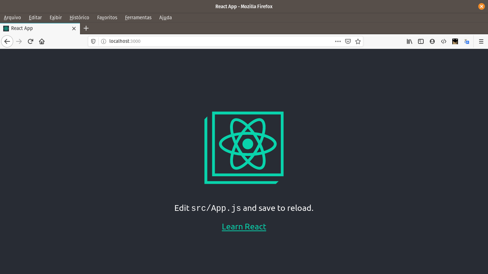
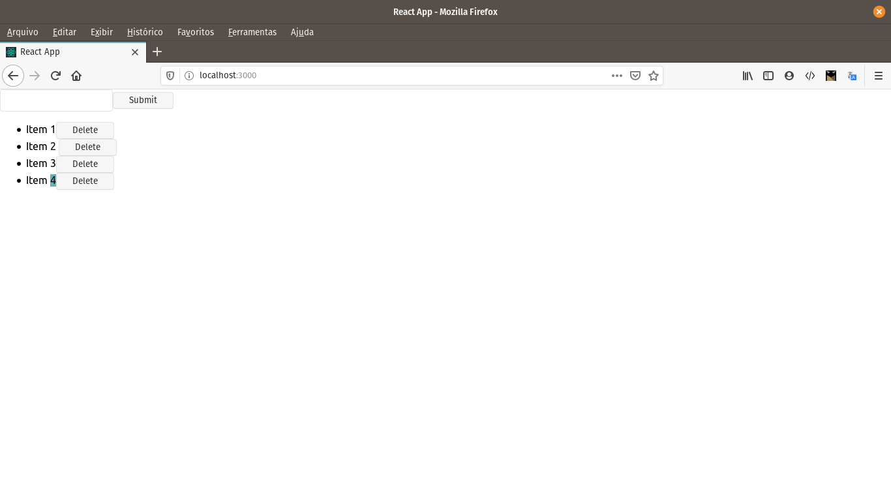

## Descrição
Somente uma breve introdução aos estudos do React. Ao final do projeto é construido uma listagem e um botão para remover os itens da lista 

## Setup
Este projeto foi criado com o [Create React App](https://github.com/facebook/create-react-app).  


**adcionando componente de forma global**
```
npm install -g create-react-app
```

**criando o projeto**
```
create-react-app app 
```

**rodando projeto criado**  
```
npm start
```

preview   



listagem com a opção de delete  

